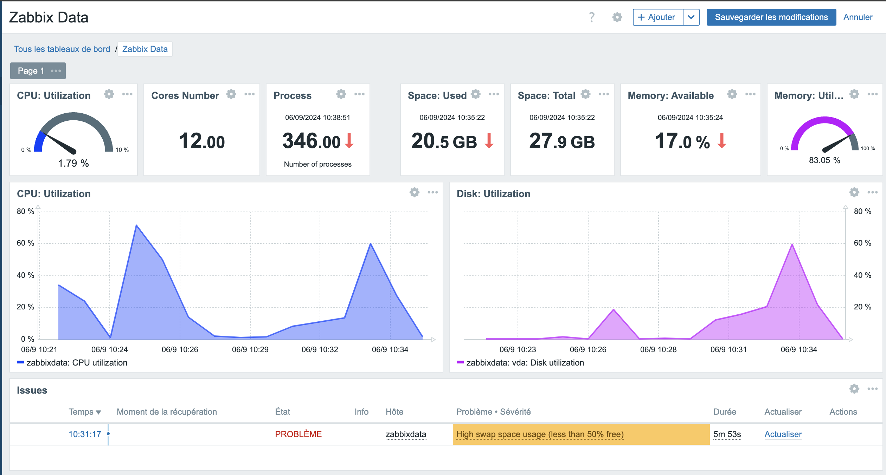
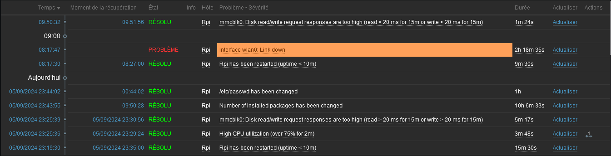
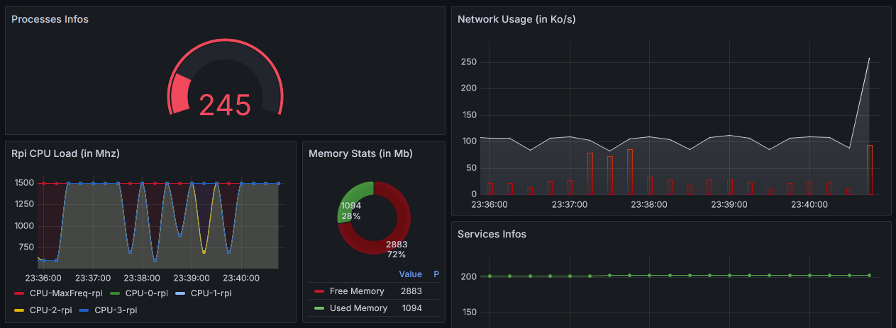
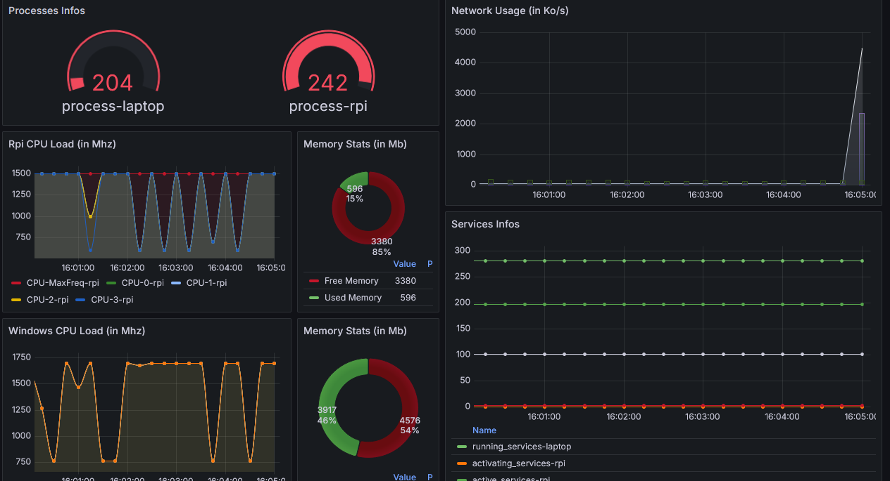
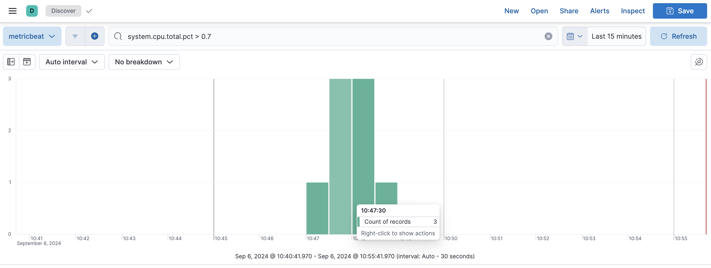

<div align="center">
  
  <h1 style="">Secu Entreprise</h1>
  <p>Projet de gestion integrant Monitoring, Supervision, et Administration des infrastructures. La collecte des données permet une d'agir de facon proactive.</p>

[](https://opensource.org/licenses/MIT)

</div>
<blockquote>
<div style=""><svg width="16" height="16" viewBox="0 0 16 16" fill="currentColor" style="vertical-align: text-bottom; padding-right: .5rem"><path d="M6.75 0h2.5C10.216 0 11 .784 11 1.75V3h3.25c.966 0 1.75.784 1.75 1.75v8.5A1.75 1.75 0 0 1 14.25 15H1.75A1.75 1.75 0 0 1 0 13.25v-8.5C0 3.784.784 3 1.75 3H5V1.75C5 .784 5.784 0 6.75 0ZM3.5 9.5a3.49 3.49 0 0 1-2-.627v4.377c0 .138.112.25.25.25h12.5a.25.25 0 0 0 .25-.25V8.873a3.49 3.49 0 0 1-2 .627Zm-1.75-5a.25.25 0 0 0-.25.25V6a2 2 0 0 0 2 2h9a2 2 0 0 0 2-2V4.75a.25.25 0 0 0-.25-.25H1.75ZM9.5 3V1.75a.25.25 0 0 0-.25-.25h-2.5a.25.25 0 0 0-.25.25V3Z"></path></svg><span style="display: inline-block; vertical-align: middle;" color="text.gray.8" contenteditable="true" spellcheck="false"><a href="https://github.com/benoit-corso">Benoit CORSO</a> - <a href="mailto:benoit.corso@laplatforme.io">benoit.corso@laplateforme.io</a></span></div><div style=""><svg width="16" height="16" viewBox="0 0 16 16" fill="currentColor" style="vertical-align: text-bottom; padding-right: .5rem"><path d="M6.75 0h2.5C10.216 0 11 .784 11 1.75V3h3.25c.966 0 1.75.784 1.75 1.75v8.5A1.75 1.75 0 0 1 14.25 15H1.75A1.75 1.75 0 0 1 0 13.25v-8.5C0 3.784.784 3 1.75 3H5V1.75C5 .784 5.784 0 6.75 0ZM3.5 9.5a3.49 3.49 0 0 1-2-.627v4.377c0 .138.112.25.25.25h12.5a.25.25 0 0 0 .25-.25V8.873a3.49 3.49 0 0 1-2 .627Zm-1.75-5a.25.25 0 0 0-.25.25V6a2 2 0 0 0 2 2h9a2 2 0 0 0 2-2V4.75a.25.25 0 0 0-.25-.25H1.75ZM9.5 3V1.75a.25.25 0 0 0-.25-.25h-2.5a.25.25 0 0 0-.25.25V3Z"></path></svg><span style="display: inline-block; vertical-align: middle;" color="text.gray.8" contenteditable="true" spellcheck="false"><a href="https://github.com/mathias-putzola">Mathias Putzola</a> - <a href="mailto:mathias.putzola@laplateforme.io">mathias.putzola@laplateforme.io</a></span></div><div style=""><svg width="16" height="16" viewBox="0 0 16 16" fill="currentColor" style="vertical-align: text-bottom; padding-right: .5rem"><path d="M6.75 0h2.5C10.216 0 11 .784 11 1.75V3h3.25c.966 0 1.75.784 1.75 1.75v8.5A1.75 1.75 0 0 1 14.25 15H1.75A1.75 1.75 0 0 1 0 13.25v-8.5C0 3.784.784 3 1.75 3H5V1.75C5 .784 5.784 0 6.75 0ZM3.5 9.5a3.49 3.49 0 0 1-2-.627v4.377c0 .138.112.25.25.25h12.5a.25.25 0 0 0 .25-.25V8.873a3.49 3.49 0 0 1-2 .627Zm-1.75-5a.25.25 0 0 0-.25.25V6a2 2 0 0 0 2 2h9a2 2 0 0 0 2-2V4.75a.25.25 0 0 0-.25-.25H1.75ZM9.5 3V1.75a.25.25 0 0 0-.25-.25h-2.5a.25.25 0 0 0-.25.25V3Z"></path></svg><span style="display: inline-block; vertical-align: middle;" color="text.gray.8" contenteditable="true" spellcheck="false"><a href="https://github.com/renovat-manirafasha">Renovat MANIRAFASHA</a> - <a href="mailto:renovat.manirafasha@laplateforme.io">renovat.manirafasha@laplateforme.io</a></span></div>
</blockquote>

## Pré-requis
```
debian 12 (bookworm) - Raspberry Pi 4
- zabbix (version: 7.0 LTS)
- php-fpm (version: 8.2)
- prometheus (version: 2.54.1)
- node_exporter (version: 1.8.2)
- windows_exporter (version: 0.28.1)
- process_exporter (version: 0.8.3)
- grafana (version: 11.2.0)
- Elasticsearch (version: 7.17.23)
- logstash (version: 7.17.23)
- kibana (version: 7.17.23)
- metricbeat (version: 7.17.23)
- thehive (version: ???)
- MISP (version: ???)
- nginx (latest)
```

### Informations d'installation
Nous utilisons directement les depots officiels afin de ne pas de soucier concernant la recuperation des packets. Voici donc les clés officiels:
```
https://repo.zabbix.com/zabbix/7.0/debian/pool/main/z/zabbix-release/zabbix-release_7.0-2+debian12_all.deb
https://apt.grafana.com/gpg.key
https://downloads.apache.org/cassandra/KEYS
https://artifacts.elastic.co/GPG-KEY-Elasticsearch
```

Pour le projet il est preferable d'avoir une machine dédié aux bases de données Elasticsearch et cassandra.
Pour des raisons de compatibilité avec TheHive, nous avons optés pour Elasticsearch version 7.x
De meme pour Zabbix qui nous permet le choix en Apache ou Nginx, nous avons eu une preference pour nginx afin de pouvoir utiliser les V-Host dans le meme temps.
Nous avons donc des domaines virtuel dédiés vers notre serveur nginx et qui sont redigés a leurs tours par reverse proxy sur le service de demandé.
La securité est renforcée car les services ne sont pas tous exposés sur le reseaux ce qui evite des fuites de données qui pourrais servir a de la reconnaissance de notre infrastructure.
<ul>
	<ol><a href="http://zabbix.nox-corp.net">http://zabbix.nox-corp.net</a></ol>
	<ol><a href="http://grafana.nox-corp.net">http://grafana.nox-corp.net</a></ol>
	<ol><a href="http://prometheus.nox-corp.net">http://prometheus.nox-corp.net</a></ol>
	<ol><a href="http://kibana.nox-corp.net">http://kibana.nox-corp.net</a></ol>
	<ol><a href="http://misp.nox-corp.net">http://misp.nox-corp.net</a></ol>
	<ol><a href="http://thehive.nox-corp.net">http://thehive.nox-corp.net</a></ol>
	<ol><a href="http://cortex.nox-corp.net">http://cortex.nox-corp.net</a></ol>
</ul>

## Déroulement du projet
### Zabbix





La configuration des alertes a ete faite par mail. En changeant les macros de l'hote associés nous avons defini les triggers a 75% de charge pour le cpu et la mémoire, sur une plage de 2min.
Pour ce faire il faut aller dans Collecte de données > Hote > déclencheurs.
- Choisir l'evenement associé puis vérifier le déclencheur parents, passer la variable au temps voulu.
Puis changer les macros concernant le niveau de charge de travail:
- Hote > macro > ajouter:
    - {$CPU.UTIL.CRIT}      = 75
    - {$IF.UTIL.MAX}        = 75
    - {$MEMORY.UTIL.MAX}    = 75
Enfin, aller dans Utilisateurs > Utilisateurs > Admin > Média:
    Puis ajouter le média correspondant, dans le cas présent pour les mails il suffit d'entrer les adresses mail des administrateurs et de mettre en place l'acces au serveur smtp de google.

### Prometheus
Pour commencer, il faut configurer prometheus sur le port souhaité, en tant que service, dans le cas present nous somme sur une machine debian 12 avec systemd.
Il faut donc creer un 'unit file'.
Une fois que l'unit-file est configuré nous devons ouvrir le fichier de configuration de prometheus afin qu'il puisse récuperer les données de node_exporter, tout comme d'autres  (windows_exporter, process_exporter entre autres).
Bien quand nous ajoutons un unit-file il faut redemarrer le daemon systemd:
```bash
# Recharge les units (services) de systemd
systemctl daemon-reload
# On active le service souhaité a l'aide de cette commande   
systemctl enable <unit>
# A present on peux demarrer le service
systemctl start <unit>
```
Dans notre situation, étant donné que toutes l'infra du projet est hebergée sur un raspberry pi. J'ai pris la decision d'ajouter [windows_exporter](https://github.com/prometheus-community/windows_exporter) et process_exporter afin de collecter plus de données (laptop et Rpi).

Node_exporter est configuré afin d'activer des [collecteurs](https://github.com/prometheus/node_exporter?tab=readme-ov-file#collectors) supplementaires, le services est donc lancé avec les collecteurs par defaut plus ceux-ci qui sont passé en tant qu'arguments dans la ligne de commande du service:
    --collector.
        - processes.
        - systemd.
        - network_route.
        - cpu_vulnerabilites.
Il faut egalement configurer prometheus pour qu'il aille taper dans les données des collecteurs.

#### Windows Exporter
installer le service sur windows:
```
msiexec /i windows_exporter-0.28.1-amd64.msi ENABLED_COLLECTORS="os,system,cpu,net,ad,iis,logon,memory,process,tcp,textfile,thermalzone,service,physical_disk" LISTEN_PORT=9182
# Open firewall
New-NetFirewallRule -DisplayName "Allow Inbound Windows Exporter" -Direction Inbound -Program "C:\Program Files\windows_exporter\windows_exporter.exe" -RemoteAddress LocalSubnet -Action Allow
```

### Grafana




Le fonctionnement et l'installation de grafana est assez simple tout se fait par l'interface, le travail a partir de ce moment la est axé sur la selection et la normalisation des données. Il faut également avoir des petites notions de certaines fonctions (et donc d'anglais ofc) afin de pouvoir normaliser et presenter les données de facon intuitive et pertinente.
Comme nous avons fait le choix d'integrer des données qui sont utile dans la gestion de notre infrastructures il faut a présent les integrés et les présenter.

### ELK (Elasticsearch, Logstash, Kibana)

#### Elasticsearch

La première étape consiste à installer Elasticsearch, qui servira d'intermédiaire entre logstach et kibana. Sur notre machine Debian 12, Elasticsearch doit être configuré pour fonctionner sur le port 9200.
Installation et configuration :
```bash
# Ajout de la clé publique et repository d'Elastic
curl -fsSL https://artifacts.elastic.co/GPG-KEY-Elasticsearch | sudo apt-key add -
sudo apt-get install apt-transport-https
echo "deb https://artifacts.elastic.co/packages/7.x/apt stable main" | sudo tee -a /etc/apt/sources.list.d/elastic-7.x.list
# Installation du paquet : 
sudo apt update
sudo apt install Elasticsearch
# Configuration :
# Modifier le fichier de configuration /etc/Elasticsearch/Elasticsearch.yml pour définir le cluster.name, le node.name et d'autres paramètres essentiels.
# S'assurer que le service est bien démarré et écoute sur le bon port en exécutant systemctl enable --now Elasticsearch.
```

#### Logstash
Logstash est utilisé pour ingérer, transformer et envoyer les logs vers Elasticsearch. Sa configuration se fait par un fichier .conf qui décrit comment les logs sont collectés et traités.
Installation et configuration :
```bash
# Installer Logstash avec le package manager.
sudo apt install logstash
# Créer un fichier de configuration, par exemple /etc/logstash/conf.d/logstash.conf qui inclut les sections suivantes :
sudo nano /etc/logstach/conf.d/logstach.conf
# Input : Données collectées de fichiers locaux ou d'autres sources comme Filebeat (Port 5044).
# Filter : Transformations des logs. (CSV / GROK)
# Output : Envoie des données à Elasticsearch (Port 9200).
```

#### Filebeat
Filebeat est un agent léger de collecte de logs développé par Elastic, qui envoie les fichiers de logs de manière continue vers Logstash ou directement vers Elasticsearch. Son rôle est de simplifier la collecte de logs sur des machines distantes, ce qui en fait un outil essentiel pour l'observation de systèmes distribués.
Installation et configuration :
```bash
# Installation du paquet :
sudo apt update
sudo apt install filebeat
# Configuration du fichier filebeat.yml :
sudo nano /etc/filebeat/filebeat.yml
```
```yml
# Input Données collectées localement :
filebeat.inputs:
- type: log
enabled: true
# Accès au fichier :
paths:
	- /path/to/*.log
# Ouput : 
output.Elasticsearch:
  hosts: ["http://localhost:9200"]
```

#### Metricbeat
Metricbeat est un agent léger utilisé pour collecter des métriques système et de services sur vos serveurs et applications. Il fait partie de la suite Beats d'Elastic, qui comprend différents agents spécialisés pour la collecte de données. Metricbeat surveille l'état des ressources (CPU, mémoire, disque, réseau, etc.) ainsi que les services tels que Docker, Kubernetes, MySQL, NGINX, etc. Ensuite, il envoie ces métriques vers des outils comme Elasticsearch ou Logstash pour un traitement et une visualisation dans Kibana.
Installation et configuration :
```bash
# Installation du paquet : 
sudo apt-get install metricbeat
# Configuration du fichier metricbeat.yml
sudo nano /etc/metricbeat/metricbeat.yml
```
```yml
# Utilisation de modules : 
metricbeat.config.modules:
	path: ${path.config}/modules.d/*.yml
 	metricbeat.modules:
      - module: system
        metricsets:
      	  - cpu
 		  - memory
      	  - network
      	  - filesystem
      	  - process
      	  - diskio
   		enabled: true
# Output :
output.Elasticsearch:
   hosts: ["http://localhost:9200"]
setup.kibana:
   host: "localhost:5601"
```

#### Kibana




Kibana sert d'interface pour visualiser et explorer les données stockées dans Elasticsearch.
Installation et configuration :
```bash
# Installer Kibana avec la package manager :
sudo apt install kibana
# Configuration du fichier Kibana.yml
sudo nano /etc/kibana/kibana.yml
```
```yml
# Écoute sur l'interface réseau : 
server.host: "0.0.0.0" 
# Écoute du port Elasticsearch :
elasticsearch.hosts: ["http://localhost:9200"]
```

#### Wireshark


<br />
<br />
<br />

On verifie le lancement de chaque services a l'aide de cette commande :
```bash
sudo tail -f /var/log/[name.service]
```
Afin de voir si il y a des details de configurations a modifié.

Concernants les outils utilisant la VM Java, nous nous sommes permit de ajouter des parametres afin de limiter l'usage de memoire vive car par defaut, la VM Java utilise 50% de la memoire disponible.
Cela se fait par les parametres:
```
-Xmx<512mo|1g>
-Xms<256mo|2g>
```
Ce n'est qu'a titre d'exemple, il est recommandé d'utiliser les memes valeurs pour -Xmx et -Xms.
```
-Xmx est pour la memoire alloué a l'execution.
-Xms est la memoire alloué pour le demarrage.
```